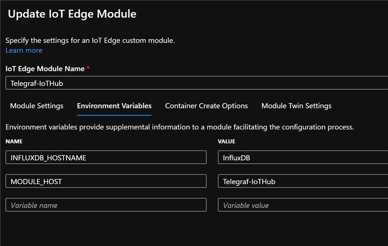

# Telegraf Output Plugin: Azure Iot Hub

Output plugin for Azure IoT Hub Edge Module

### Configuration:

```toml
## One of the following sets required for configuration:
#  
## For use on IoT Edge: (creates client from environment variables)
#
# use_gateway = true
#
## To specify a device/module connection string:
#
#  connection_string = ""
#  use_gateway = true
#
## To use a shared access key to form a connection string
#
#  hub_name = ""
#  device_id = ""
#  module_id = ""
#  shared_access_key = ""
#  use_gateway = true

connection_string = "HostName=[MYIOTHUB].azure-devices.net;DeviceId=[MYEDGEDEVICE];ModuleId=[MYTELEGRAFMODULE];SharedAccessKey=[MYSHAREDACCESSKEY(Primary)]"
use_gateway = true
```

If you are configuring this in IoT Hub, use the sample image below to create
the telegraf module.



```
# Minimal sample config file for Telegraf to read data from IoT Edge and
# then route that data along with a set of metrics to both a local InfluxDB database and
# the upstream Azure IoT Hub. 
[global_tags]
  dc = "$MODULE_HOST"

[agent]
  interval = "5s"
  round_interval = true
  metric_batch_size = 1000
  metric_buffer_limit = 10000
  collection_jitter = "0s"
  flush_interval = "5s"
  flush_jitter = "0s"
  precision = ""
  debug = true
  hostname = ""
  omit_hostname = false


###############################################################################
#                            OUTPUT PLUGINS                                   #
###############################################################################

[[outputs.azure_iothub]]
  use_gateway = true

[[outputs.influxdb]]
  urls = ["http://$INFLUXDB_HOSTNAME:8086"]
  database = "opcdata"
  precision = "s"

###############################################################################
#                            INPUT PLUGINS                                    #
###############################################################################

[[inputs.azure_iothub_consumer]]
  use_gateway = true

[[inputs.cpu]]
  percpu = true
  totalcpu = true
  collect_cpu_time = false
  report_active = false

[[inputs.disk]]
  ignore_fs = ["tmpfs", "devtmpfs", "devfs", "iso9660", "overlay", "aufs", "squashfs"]
```
